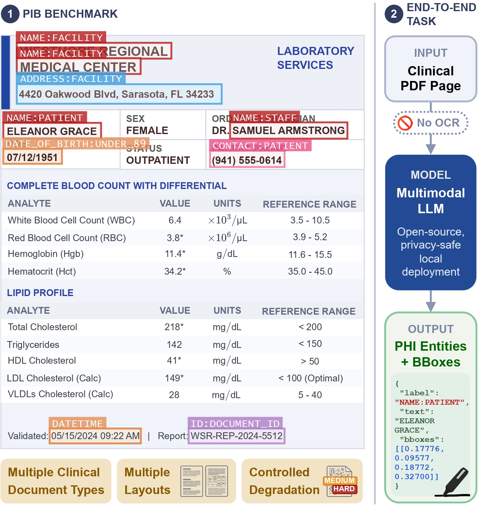

# Paint-It-Black

*Official code for Paint-It-Black (PIB) — the first benchmark for end-to-end, pixel-level PHI de-identification in clinical PDF documents using open-source MLLMs.*

<p align="center">
  
</p>

This repository contains the code for building, augmenting, and evaluating the **Paint-It-Black (PIB)** benchmark — the first benchmark designed to assess open-source multimodal large language models on **end-to-end, pixel-level PHI de-identification** in clinical PDF documents under a HIPAA-aligned label taxonomy.
Clinical records arrive as structured PDFs with heterogeneous visual layouts, multi-column tables, and letterheads; PIB evaluates the raw spatial-grounding capability of MLLMs directly — no OCR stage, no text extraction.

Some samples of the dataset are available in the "samples" folder. Whole benchmark dataset, comprising physician-validated documents with manually curated bounding-box annotations across multiple document types and three controlled visual degradation tiers, will be publicly available on Hugging Face in case of acceptance.

---

## Overview

A benchmark pipeline for evaluating multimodal large language models on the task of **medical document de-identification**. The project covers the full workflow from raw annotated PDFs to structured evaluation results:

1. **Benchmark document generation** — use a Gemini LLM to synthesise realistic clinical document variants (lab reports, CT/MRI radiology reports, gynaecological consultations) as HTML + PDF, providing a controlled source of PHI-rich documents for the benchmark.
2. **Annotation** — browser-based tool for drawing PHI bounding boxes on PDF pages.
3. **Dataset building** — convert annotated PDFs into a HuggingFace `Dataset` with image + label columns.
4. **Analysis** — compute comprehensive statistics on dataset composition and label distribution.
5. **Augmentation** — simulate realistic hospital scan degradation (fax, stains, noise, skew, …) to create difficulty levels.
6. **Inference** — run any OpenAI-compatible vision-language model on each document page, extract predicted PHI entities, and compute a comprehensive suite of benchmark metrics.

---

## Project Structure

```
multimodal-deid/
├── config/
│   ├── labels.yaml             # Canonical PHI label list — source of truth for the project
│   ├── dataprep/               # Augmentation configs (presets + per-augmentation examples)
│   │   └── generate_benchmark.yaml  # Benchmark generation config (model, retries, output dir)
│   └── inference/
│       ├── base.yaml           # Default inference config (local VLLM + Qwen3 thinking model)
│       ├── openai.yaml         # Remote OpenAI backend config
│       ├── gemma4.yaml         # Gemma 4 preset (reasoning parser + custom chat template)
│       ├── internvl.yaml       # InternVL3 preset (thinking via system prompt)
│       └── medgemma.yaml       # MedGemma preset (thinking via system instruction)
├── data/                       # Not tracked — populated by the user
├── docker/
│   ├── Dockerfile              # Based on vllm/vllm-openai; adds project deps
│   └── requirements.txt
├── docs/
│   ├── augmentation.md         # Augmentation pipeline — all degradation types, presets, sampling
│   ├── inference.md            # Inference pipeline — task formulation, prompt, batching, retries
│   ├── metrics.md              # Complete metrics reference with mathematical definitions
│   └── metrics_design.md       # Metrics design rationale and redesign history
├── experiments/
│   ├── generate_benchmark.sh   # Generate synthetic clinical documents via Gemini
│   ├── augment_split.sh        # Build medium + hard augmented splits from base
│   ├── augment_tuning.sh       # Run all augmentation example configs for visual tuning
│   ├── load_annotations.sh     # Build base split from annotations and push to HF Hub
│   ├── push_to_hub.sh          # Resize all splits to target DPI and push to HF Hub
│   ├── quick_eval.sh           # Run inference on a small subset + render predictions (Docker)
│   ├── quick_eval_bsub.sh      # Same as quick_eval.sh but for LSF cluster (no Docker)
│   ├── render_results.sh       # Render bounding-box predictions from a results.json
│   ├── render_split.sh         # Render all pages of a dataset split with GT boxes
│   ├── resample_hard.sh        # Re-augment specific rows of the hard split
│   └── run_all_splits_bsub.sh  # Run all three splits in parallel on the LSF cluster
├── migrate_annotations.py      # One-shot migration script for label renames
├── output/                     # Augmented PNGs and inference results (not tracked)
├── scripts/
│   ├── build_image_3090.sh             # Build Docker image for RTX 3090 (CUDA 11.x)
│   ├── build_image_5090.sh             # Build Docker image for RTX 5090 (CUDA 12.x)
│   ├── run_cont.sh                     # Run any command inside the container
│   ├── run_job.sh                      # SLURM HPC submission wrapper
│   ├── run_vllm_inference.sh           # Start VLLM serve + inference in one container (Docker)
│   └── run_vllm_inference_bsub.sh      # Submit VLLM serve via LSF bsub + run inference locally
├── src/
│   ├── analysis/
│   │   ├── analyze_dataset.py           # Dataset statistics → markdown report
│   │   └── render_dataset.py            # Render dataset pages with bounding boxes
│   ├── core/
│   │   ├── labels.py           # load_labels() / load_label_guidelines() — reads config/labels.yaml
│   │   ├── llm_client.py       # OpenAI-compatible client with retry logic
│   │   ├── template_handler.py # Prompt template loader + output parser (multimodal-aware)
│   │   └── utils.py            # ConfigArgumentParser, logging, seed, output dir helpers
│   ├── dataprep/
│   │   ├── annotation_app.html  # Standalone browser annotation tool (no server needed)
│   │   ├── augment_pdfs.py      # PDF / HF dataset → augmented split pipeline
│   │   ├── build_dataset.py     # Annotated PDFs → HuggingFace Dataset
│   │   ├── generate_benchmark.py # Gemini-driven synthetic document generator (HTML + PDF)
│   │   └── push_to_hub.py       # Resize local splits to target DPI and push to HF Hub
│   ├── inference/
│   │   ├── metrics.py          # Full benchmark metric suite
│   │   ├── render_predictions.py # Overlay prediction boxes on page images
│   │   └── run_inference.py    # Main inference + evaluation script
│   └── tests/
│       ├── test_analyze_dataset.py
│       ├── test_augment_dataset_hf.py
│       ├── test_augment_page_sampling.py
│       ├── test_generate_benchmark.py
│       ├── test_llm_client.py
│       ├── test_metrics.py
│       ├── test_render_predictions.py
│       └── test_run_inference.py
└── templates/
    ├── benchmark/
    │   ├── ct_report.yaml              # CT radiology report generation template
    │   ├── gynecological_report.yaml   # Gynaecological consultation generation template
    │   ├── lab_report.yaml             # Lab report generation template
    │   └── mri_report.yaml             # MRI radiology report generation template
    ├── deid_template.yaml              # Default multimodal PHI prompt template
    ├── deid_template_internvl.yaml     # InternVL3 variant (thinking via system prompt)
    ├── deid_template_medgemma.yaml     # MedGemma variant (thinking via system instruction)
    └── gemma4_chat_template.jinja      # Custom chat template for Gemma 4 thinking mode
```

---

## Getting Started

### Prerequisites

- **Docker** with GPU support (`nvidia-container-toolkit`)
- **NVIDIA driver** compatible with your GPU
- **~30 GB disk** for the Docker image (VLLM base is large)
- `curl` on the host (used by `run_vllm_inference.sh` for the health check)

### Docker Build

There are two build scripts targeting different GPU generations:

```bash
# RTX 3090 / older CUDA 11.x GPUs
./scripts/build_image_3090.sh

# RTX 5090 / CUDA 12.x GPUs
./scripts/build_image_5090.sh
```

The image is based on `vllm/vllm-openai` with project-specific Python packages
(`augraphy`, `datasets`, `pdf2image`, `openai`, …) installed on top.
The first build downloads the full VLLM base image (~18 GB); subsequent builds are cached.

### Environment

Copy `.env.example` to `.env` and fill in the values:

```bash
cp .env.example .env
```

```
HF_TOKEN=hf_...          # Required for gated models and pushing to HF Hub
HF_HOME=./hf_home        # Required — model cache directory; run_vllm_inference.sh will error without it
WANDB_API_KEY=...         # Optional — enables W&B tracking (set wandb: true in inference config)
WANDB_PROJECT=multimodal-deid  # Optional — W&B project name
```

`HF_HOME` must point to an existing (or creatable) directory. On first run it will be populated with downloaded model weights. `run_vllm_inference.sh` mounts it into the container so models only need to be downloaded once.

For the LSF/bsub cluster workflow, `run_vllm_inference_bsub.sh` instead reads `HF_HUB_CACHE` from `.env` (the standard HuggingFace Hub cache path on the cluster).

---

## Running the Container

All commands run from the **project root**.

```bash
# Interactive shell
./scripts/run_cont.sh

# Run a single command
./scripts/run_cont.sh python3 src/dataprep/build_dataset.py --help

```

`run_cont.sh` uses `--network host` so the container can reach host services
(e.g. a VLLM server started separately). The GPU device is set via `CUDA_VISIBLE_DEVICES` in `.env`.

---

## PHI Labels

All PHI label names are defined in `config/labels.yaml`, which is the single source of truth for the whole project (annotation app, prompt template, metrics, dataset builder all read from it).

Labels follow a `PARENT:SUBLABEL` convention. Current label set:

| Category | Labels |
|---|---|
| **NAME** | `NAME:PATIENT`, `NAME:STAFF`, `NAME:ASSOCIATE`, `NAME:FACILITY`, `NAME:DEPARTMENT` |
| **DATE_OF_BIRTH** | `DATE_OF_BIRTH:UNDER_89`, `DATE_OF_BIRTH:OVER_89` |
| **DATETIME** | `DATETIME` |
| **AGE** | `AGE:UNDER_89`, `AGE:OVER_89` |
| **ID** | `ID:PATIENT_ID`, `ID:DOCUMENT_ID`, `ID:SPECIMEN_ID`, `ID:STAFF_ID`, `ID:DEVICE_ID`, `ID:EXAM_ID`, `ID:ADMISSION_ID` |
| **CONTACT** | `CONTACT:PATIENT`, `CONTACT:STAFF`, `CONTACT:ASSOCIATE`, `CONTACT:FACILITY` |
| **ADDRESS** | `ADDRESS:PATIENT`, `ADDRESS:FACILITY` |

Each label also has a one-line `description` field in `config/labels.yaml`. The `{labels_with_guidelines}` template placeholder (used by the default template) injects these descriptions as a bullet list into the prompt, giving the model concise annotation guidance per label type. The simpler `{labels}` placeholder remains available for a comma-separated list without descriptions.

When adding or renaming labels: edit `config/labels.yaml`, then update `src/dataprep/annotation_app.html` (the `LABELS` array with its color/size metadata). The prompt template injects labels automatically at load time.

---

## Benchmark Document Generation

`src/dataprep/generate_benchmark.py` uses the **Google Gemini API** to synthesise realistic
synthetic clinical documents — HTML rendered to PDF via WeasyPrint — across four document types.
Each variant is parameterised along a grid of country, patient demographics, exam/panel type,
visual style, and page count, producing a diverse and controlled source of PHI-rich documents.

### Prerequisites

Add `GOOGLE_API_KEY` to your `.env` file. `run_cont.sh` loads `.env` automatically and
passes it into the container:

```
GOOGLE_API_KEY=AIza...
```

### Quick start

```bash
# Generate 10 random MRI variants
./experiments/generate_benchmark.sh

# Preview the generation plan without making any API calls
./scripts/run_cont.sh python3 src/dataprep/generate_benchmark.py \
    --config dataprep/generate_benchmark --dry_run

# Generate 5 random lab + CT variants
./scripts/run_cont.sh python3 src/dataprep/generate_benchmark.py \
    --config dataprep/generate_benchmark --types lab ct --count 5
```

Output goes to `output/benchmark/` by default: one `.html` and one `.pdf` per variant,
plus a `manifest.json` tracking generation status and all parameters.

### Document Types

| Type | Template | Grid axes |
|---|---|---|
| `lab` | `templates/benchmark/lab_report.yaml` | pages (1–4), country, sex, age range, clinical context, lab panels, visual style |
| `ct` | `templates/benchmark/ct_report.yaml` | pages (1–2), country, sex, age range, CT exam type, clinical indication, visual style |
| `mri` | `templates/benchmark/mri_report.yaml` | pages (1–3), country, sex, age range, MRI exam type, clinical indication, visual style |
| `gynecology` | `templates/benchmark/gynecological_report.yaml` | pages (1–3), country, age range, clinical scenario, visual style |

Templates follow the standard `TemplateHandler` YAML format (system + user messages).
The user message uses `{placeholder}` slots that are filled per variant. A `{page_context}`
slot is pre-computed in the script from a page-count → description lookup before
calling `handler.format()`.

### Resumability

On each run the script loads `manifest.json` from the output directory (if present) and
skips any variant whose parameter combination already completed successfully. Re-running
after a partial failure or interruption continues from where it left off.

### Self-correction

When `--self_correct_max` > 0 (default: 1), the model is shown the rendered PDF of its
own HTML output and asked to fix layout issues (text clipping, sparse pages, sidebar
height). The correction is only accepted if the page count stays correct and the PDF
renders successfully.

### `generate_benchmark.py` Reference

Config file: `config/dataprep/generate_benchmark.yaml`. All keys can be overridden on the CLI.

| Flag | Default | Description |
|---|---|---|
| `--config STR` | — | Config file name under `config/dataprep/` (without `.yaml`) |
| `--types STR+` | all | Document types to generate: `lab`, `ct`, `mri`, `gynecology` |
| `--count INT` | — | Number of randomly sampled variants (across selected types). Omit for the full grid. |
| `--dry_run` | off | Print the generation plan without making any API calls |
| `--model STR` | `gemini-3-flash-preview` | Gemini model to use |
| `--output_dir STR` | `output/benchmark` | Directory for generated HTML, PDF, and manifest |
| `--retry_max INT` | `3` | Max attempts per variant before marking as failed |
| `--retry_wait INT` | `10` | Seconds between retry attempts |
| `--self_correct_max INT` | `1` | Visual self-correction rounds after initial render (0 = disabled) |

---

## Data Preparation

### 1 — Annotate

Open `src/dataprep/annotation_app.html` in a browser (no server required — it uses the
File System Access API). Click **Open Folder**, select a directory containing PDF files,
draw bounding boxes for each PHI entity, assign labels from the sidebar, and save.
The tool writes an `annotation.json` file into the same directory.

### 2 — Build Dataset

```bash
# Save locally
./scripts/run_cont.sh python3 src/dataprep/build_dataset.py \
    --input_dir data/dev_annotation_cases \
    --output data/my_dataset \
    --split_name base \
    --dpi 300

# Or push directly to HF Hub (requires HF_TOKEN in .env)
./scripts/run_cont.sh python3 src/dataprep/build_dataset.py \
    --input_dir data/dev_annotation_cases \
    --output disi-unibo-nlp/paint-it-black \
    --split_name base \
    --dpi 300 \
    --push_to_hub
```

Produces a HuggingFace `Dataset` with columns:
`image` (PIL), `page` (int), `total_pages` (int), `doc_type` (str), `source_pdf` (str),
`annotations` (list of `{id, label, text, bboxes}`).
Bounding boxes are normalised `[y_min, x_min, y_max, x_max]` in `[0, 1]`.

The builder logs one compact line per leaf directory showing included / skipped counts.
Errors (missing PDFs, empty bboxes, multiple JSON files) are grouped by type, not per-file.

Or use the experiment script, which builds the base split and pushes to Hub:
```bash
./experiments/load_annotations.sh
```

### 3 — Analyze Dataset

After building a dataset, generate a full statistics report:

```bash
# From a local dataset
./scripts/run_cont.sh python3 src/analysis/analyze_dataset.py \
    --dataset data/my_dataset \
    --split base \
    --local

# From HF Hub
./scripts/run_cont.sh python3 src/analysis/analyze_dataset.py \
    --dataset disi-unibo-nlp/paint-it-black \
    --split base
```

The report is written to `output/analysis_<split>_<timestamp>.md` and covers:
- Page counts (total / annotated / empty)
- Annotation density buckets and averages
- Per-label distribution (count, %, avg chars, multi-bbox rate)
- Label imbalance ratio and zero-count labels
- Rare labels (≤ 10 occurrences) with source PDFs
- Top label co-occurrences
- Source breakdown from filenames (country, sex)
- Per-doc-type breakdown

### 4 — Augment

`augment_pdfs.py` in HF dataset mode reads a split from a local or Hub dataset, applies
augraphy degradation, and writes the augmented split back. Annotations are preserved unchanged.

```bash
# Medium difficulty (low noise)
./scripts/run_cont.sh python3 src/dataprep/augment_pdfs.py \
    --input_dataset disi-unibo-nlp/paint-it-black \
    --input_split base \
    --output_split medium \
    --config config/dataprep/low_noise_mix \
    --seed 1 \
    --push_to_hub

# Hard difficulty (high noise)
./scripts/run_cont.sh python3 src/dataprep/augment_pdfs.py \
    --input_dataset disi-unibo-nlp/paint-it-black \
    --input_split base \
    --output_split hard \
    --config config/dataprep/high_noise_mix \
    --seed 1 \
    --push_to_hub
```

Use `--output_scale` to downscale images after augmentation (e.g. base built at 300 DPI,
save augmented at 200 DPI equivalent):
```bash
--output_scale 0.667   # 200/300 ≈ 0.667
```

Or run both splits at once:
```bash
./experiments/augment_split.sh
```

---

## Inference & Evaluation

### Inference Configs

Config files under `config/inference/` cover the tested model families. All flags can be overridden on the CLI.

| Config | Model family | Key settings |
|---|---|---|
| `base.yaml` | Qwen3 VL (thinking) | `enable_thinking: true`, `guided_json: false` |
| `openai.yaml` | Remote OpenAI / compatible API | `backend: openai` |
| `gemma4.yaml` | Gemma 4 | `reasoning_parser gemma4`, custom chat template, `guided_json: false` |
| `internvl.yaml` | InternVL3 | Thinking via system prompt, `temperature: 0.6` |
| `medgemma.yaml` | MedGemma | Thinking via system instruction, `guided_json: false` |

### Prompt Templates

Templates live in `templates/` and are YAML files loaded by `TemplateHandler`. Content
fields can be strings (text-only) or lists of typed blocks for multimodal messages:

```yaml
messages:
  - role: system
    content: "You are a de-identification expert..."
  - role: user
    content:
      - type: image
        variable: page_image     # PIL Image passed from the inference loop → base64 JPEG
      - type: text
        text: "List all PHI entities in this document page."

output_fields:
  - name: entities
    pattern: null        # null = use the full model output as-is
    required: true
```

The default template (`templates/deid_template.yaml`) instructs the model to return a
JSON array of `{label, text, bbox_2d}` objects with coordinates in `[0, 1000]` range.
The inference script rescales to `[0, 1]` automatically. It uses the `{labels_with_guidelines}`
placeholder, which is replaced at load time with a bullet list of `label: description` entries
from `config/labels.yaml`. Only `{identifier}` slots are substituted — other braces such as
CSS blocks or JSON examples pass through untouched and do not need escaping.

Templates can also define a `structured_output` block — a JSON schema expressed as native
YAML. When `--guided_json` is set, this schema is passed to the API via `response_format`
to constrain the model's output. The `label.enum` field accepts the placeholder `"{labels}"`
which is replaced at load time with the actual label list.

| Template | Use case |
|---|---|
| `deid_template.yaml` | Default — standard and thinking models via vLLM or OpenAI API |
| `deid_template_internvl.yaml` | InternVL3 — thinking protocol injected via system message |
| `deid_template_medgemma.yaml` | MedGemma — `SYSTEM INSTRUCTION: think silently` preamble |
| `gemma4_chat_template.jinja` | Passed via `--chat_template` to `vllm serve` to enable Gemma 4's thinking channel |

### Thinking Models

Thinking traces are automatically stripped from model output before JSON parsing. The mechanism depends on the model:

| Model family | Thinking trigger | Strip mechanism |
|---|---|---|
| Qwen3 VL | `--enable_thinking` + `--reasoning_parser qwen3` (bsub) | `<think>…</think>` / bare `</think>` |
| InternVL3 | System prompt in `deid_template_internvl.yaml` | `<think>…</think>` / bare `</think>` |
| MedGemma | System instruction in `deid_template_medgemma.yaml` | `<unused94>…<unused95>` tokens |
| Gemma 4 | `--reasoning_parser gemma4` + `gemma4_chat_template.jinja` | Fallback last-`[` JSON scan |

---

### Option A — Local Docker Container

The fastest way to test a model on a small subset and visually inspect predictions:

```bash
# Default: 10 samples from the base split of disi-unibo-nlp/paint-it-black
./experiments/quick_eval.sh

# Custom sample count and split
./experiments/quick_eval.sh --n 5 --split medium
```

This runs inference (via `run_vllm_inference.sh`) then immediately renders bounding box
predictions as annotated PNG images into `output/inference/<run_name>/renders/`.

#### Manual invocation

```bash
./scripts/run_vllm_inference.sh \
    --model Qwen/Qwen3-VL-7B-Instruct \
    --vllm_max_model_len 24576 \
    --config config/inference/base.yaml \
    --input_dataset disi-unibo-nlp/paint-it-black \
    --input_split base \
    --from_hub \
    --run_name my_run
```

`run_vllm_inference.sh` starts `vllm serve` and the inference script **inside the same
container** so `localhost:8000` is always reachable without network configuration.
It reads `HF_HOME` and `HF_TOKEN` from `.env` automatically.

#### `run_vllm_inference.sh` Reference

```
Usage: ./scripts/run_vllm_inference.sh --model MODEL [vllm options] [inference options]

VLLM serve options (consumed by this script):
  --model MODEL                         Model name or HuggingFace path (required)
  --vllm_port PORT                      Port for VLLM serve (default: 8000)
  --vllm_gpu_memory_utilization FLOAT   GPU memory fraction (default: 0.95)
  --vllm_max_model_len INT              Max token length (default: 8192)
                                        Must exceed image tokens + prompt tokens.
                                        At 200 DPI, an A4 page ≈ 4000–6000 tokens with Qwen-VL.
                                        Use 16384–24576 for higher DPI or long prompts.
  --vllm_tensor_parallel_size INT       Number of GPUs for tensor parallelism (default: 1)

All other flags are forwarded verbatim to run_inference.py.
```

#### Remote API Backend (OpenAI, etc.)

```bash
./scripts/run_cont.sh python3 src/inference/run_inference.py \
    --config config/inference/openai.yaml \
    --input_dataset disi-unibo-nlp/paint-it-black \
    --input_split base \
    --from_hub \
    --api_key $OPENAI_API_KEY \
    --run_name eval_gpt4o_base
```

---

### Option B — LSF/HPC Cluster (no Docker)

`run_vllm_inference_bsub.sh` submits `vllm serve` as an LSF job on a GPU node, waits for
the server to become ready (with host discovery and stale-server detection), runs inference
locally, then kills the job. No Docker required. It reads `HF_HUB_CACHE` and `HF_TOKEN`
from `.env`.

#### Quick iteration

```bash
# Quick eval on LSF cluster (runs in background, logs to output/)
./experiments/quick_eval_bsub.sh --split medium --n 20

# Full benchmark across all three splits in parallel
./experiments/run_all_splits_bsub.sh
```

`quick_eval_bsub.sh` runs inference then immediately renders predictions. It self-backgrounds
by default (logs to `output/run_<name>.log`); pass `--fg` to run in the foreground.

#### Manual invocation

```bash
./scripts/run_vllm_inference_bsub.sh \
    --model Qwen/Qwen3-VL-7B-Instruct \
    --reasoning_parser qwen3 \
    --vllm_max_model_len 24576 \
    --enable_prefix_caching \
    --config config/inference/base.yaml \
    --input_dataset disi-unibo-nlp/paint-it-black \
    --input_split base \
    --from_hub \
    --run_name my_run
```

#### `run_vllm_inference_bsub.sh` Reference

vLLM serve and bsub-specific flags consumed by this script (all other flags are forwarded to `run_inference.py`):

| Flag | Default | Description |
|---|---|---|
| `--model MODEL` | — | Model name or HuggingFace path (required) |
| `--vllm_port INT` | `8000` | Port for `vllm serve` |
| `--vllm_gpu_memory_utilization FLOAT` | `0.95` | GPU memory fraction |
| `--vllm_max_model_len INT` | `8192` | Max token context length |
| `--vllm_tensor_parallel_size INT` | `1` | Tensor parallelism across GPUs |
| `--bsub_mem STR` | `128G` | LSF memory request |
| `--bsub_gpu_model STR` | H100 80GB | LSF GPU model selector |
| `--reasoning_parser STR` | — | vLLM reasoning parser: `qwen3`, `gemma4`, or omit |
| `--chat_template PATH` | — | Custom Jinja chat template (Gemma 4: `templates/gemma4_chat_template.jinja`) |
| `--enable_prefix_caching` | off | Enable vLLM prefix caching |
| `--kv_cache_dtype STR` | — | KV cache dtype, e.g. `fp8` for FP8-quantised models |
| `--vision_tokens INT` | — | Gemma 4 image token budget: `70\|140\|280\|560\|1120` |
| `--dtype STR` | — | Model dtype, e.g. `bfloat16` |
| `--trust_remote_code` | off | Required for some models (InternVL, some Qwen variants) |

---

### `run_inference.py` Reference

```
General:
  --run_name STR          Label for this run; becomes the output subdirectory (default: inference_run)
  --log_level STR         Logging verbosity (default: INFO)
  --seed INT              Random seed (default: 42)
  --max_samples INT       Cap the number of samples processed (useful for quick checks)
  --batch_size INT        Concurrent requests sent to the server per batch (default: 8)
  --guided_json           Enable vLLM structured outputs — constrains model to the JSON schema
                          defined in the template (requires vLLM with xgrammar backend)

Dataset:
  --input_dataset PATH    HF repo ID or local path to the HF dataset root [required]
  --input_split STR       Split to evaluate (default: base)
  --from_hub              Load from HuggingFace Hub instead of local disk
  --output_dir PATH       Output root (default: output/inference)

Template:
  --template PATH         Prompt template YAML (default: templates/deid_template.yaml)

Backend / API:
  --backend STR           openai | vllm | anthropic (default: vllm)
  --model STR             Model name [required]
  --base_url URL          API base URL (default: http://localhost:8000/v1)
  --api_key STR           API key; use EMPTY for local VLLM (default: EMPTY)
  --max_new_tokens INT    Max tokens to generate (default: 2048)
  --timeout INT           Request timeout in seconds (default: 120)
  --max_retries INT       Attempts per sample on parse failure; 0 = single attempt (default: 3)

Sampling (for thinking models):
  --temperature FLOAT     Sampling temperature (None = server default)
                          Do NOT set to 0 for thinking models — causes endless repetition.
                          Recommended for Qwen3: 0.6
  --top_p FLOAT           Top-p nucleus sampling (recommended for Qwen3: 0.95)
  --top_k INT             Top-k sampling via vLLM extra_body (recommended for Qwen3: 20)
  --min_p FLOAT           Min-p sampling via vLLM extra_body
  --enable_thinking       Pass enable_thinking=True to vLLM (required for Qwen3 thinking models)

Evaluation:
  --iou_thresholds FLOAT+ IoU thresholds for end-to-end F1 (default: 0.25 0.5 0.75)

Tracking:
  --wandb                 Enable W&B logging (requires WANDB_API_KEY in .env)
```

Config files under `config/inference/` use the same key names and can be passed via
`--config config/inference/base.yaml`. CLI flags override config values.

### Output Files

Each run writes its results to `output/inference/<run_name>/`:

| File | Description |
|---|---|
| `results.json` | Full results: args, metrics, per-sample predictions and annotations |
| `raw_completions.jsonl` | Raw model completions, one JSON line per sample, flushed per batch — useful for debugging parse failures |

### Rendering Predictions

After an inference run, overlay predicted bounding boxes on page images:

```bash
# Render the first N samples from a specific results.json
./experiments/render_results.sh

# Or directly:
./scripts/run_cont.sh python3 src/inference/render_predictions.py \
    --results output/inference/my_run/results.json \
    --limit 20
```

Renders are written to `output/inference/<run_name>/renders/`.

To render ground-truth annotations for a whole dataset split:
```bash
./experiments/render_split.sh
```

### Metrics

Results in `results.json` are structured into three groups. Full metric definitions with mathematical formulations are in `docs/metrics.md`. Design rationale is in `docs/metrics_design.md`.

#### `summary` — flat headline numbers

| Key | Description |
|---|---|
| `span_exact_micro_f1` | Micro F1 from exact-text entity matching (bbox-blind) |
| `span_exact_macro_f1` | Macro F1 over supported labels (exact text match) |
| `avg_e2e_f1` | Mean end-to-end F1 across all IoU thresholds — single bbox quality number (analogous to COCO mAP) |
| `unconditional_mean_iou` | Mean best same-label IoU per GT entity, 0 if unmatched — honest localization quality |
| `mean_iou` | Mean IoU for pairs matched at IoU > 0.5 only (always ≥ 0.5 by construction; use unconditional_mean_iou for overall quality) |
| `char_f1` | Mean SQuAD-style char-level F1 on text-matched pairs (independent of bbox) |
| `exact_match_rate` | Fraction of text-matched pairs with exact text reproduction |
| `spatial_char_f1` | Mean char-level F1 on spatially-matched pairs (IoU > 0.5) — joint localization + transcription quality |
| `spatial_exact_match_rate` | Fraction of spatially-matched pairs (IoU > 0.5) with exact text reproduction (denominator = matched pairs only) |
| `pass_rate` | Fraction of **all** GT entities correctly found: exact text match + same label + bbox IoU > 0.5. Denominator is the full GT count, so missed and mislocalized entities both reduce the score. The primary joint quality metric. |
| `hallucination_rate` | FP / (TP + FP) — entities predicted that don't correspond to any GT (text-based) |
| `miss_rate` | FN / (TP + FN) — GT entities not found by the model (text-based) |
| `format_compliance` | Fraction of samples where the model returned parseable JSON |

#### `text_extraction` — NER / transcription quality

**Bbox-blind.** Matching is done by label + character-level text F1 > 0.5.

| Key | Description |
|---|---|
| `detection` | P/R/F1 with partial text matching. Contains `micro`, `per_label`, and macro keys. See the macro note below for the distinction between `macro_f1` and `macro_f1_all`. |
| `span_exact` | Same structure as `detection` but requires exact text match (case-insensitive). Stricter than detection — partial text matches count as FP/FN here. |
| `char_f1` | Mean character-level F1 for text-matched pairs. Measures transcription accuracy independent of localization. |
| `edit_distance` | Mean normalised Levenshtein distance for text-matched pairs (0 = identical, 1 = completely different). |
| `exact_match_rate` | Fraction of text-matched GT entities where text was exactly reproduced. |

> **`macro_f1` vs `macro_f1_all`** — Both are unweighted averages of per-label F1, but they differ in which labels are included. `macro_f1` averages only over labels that have at least one GT instance in the evaluated split ("supported" labels). `macro_f1_all` averages over every label in the full label set, including labels absent from the split (which contribute F1 = 0). `macro_f1_all` is therefore always ≤ `macro_f1`. Use `macro_f1` to measure model quality on the label types actually present; use `macro_f1_all` for a conservative, dataset-coverage-penalised view.

#### `bbox_localization` — spatial localization quality

**Text-blind.** Matching is done by label + bbox IoU > threshold.

| Key | Description |
|---|---|
| `avg_e2e_f1` | Mean micro F1 across all configured IoU thresholds. Single number summarising localization quality across the leniency range. |
| `unconditional_mean_iou` | For each GT entity, best same-label prediction IoU (or 0 if no prediction exists). Mean over all GT entities. Penalises misses and misplacements in full. |
| `mean_iou` | Mean IoU of pairs that already matched at IoU > 0.5. Always ≥ 0.5; measures precision of well-placed boxes only. |
| `end_to_end` | Per-threshold breakdown. Keys are strings: `"@0.25"`, `"@0.5"`, `"@0.75"`. Each contains `micro` (P/R/F1/TP/FP/FN), `per_label`, and macro keys. |
| `spatial_char_f1` | Mean char-level F1 evaluated on bbox-matched pairs (IoU > 0.5). Measures transcription quality conditioned on correct localization. |
| `spatial_exact_match_rate` | Fraction of bbox-matched pairs (IoU > 0.5) where text was exactly reproduced (denominator = matched pairs only). |

#### Diagnostics

| Key | Description |
|---|---|
| `hallucination_rate` | `{"overall": float, "per_label": {...}}` — overall and per-label FP rates (text-based matching) |
| `miss_rate` | `{"overall": float, "per_label": {...}}` — overall and per-label FN rates (text-based matching) |
| `coarse_f1` | Detection F1 with labels collapsed to parent (`NAME:PATIENT` → `NAME`). Useful for diagnosing category-level vs. subcategory-level errors. |
| `label_confusion` | `{gt_label: {pred_label: count}}` — FP predictions that spatially overlap a GT entity of a different label (IoU > 0.3). |
| `format_compliance` | Also at the top level for convenience. |

Multi-box entities (PHI spanning non-contiguous regions) are reduced to their
axis-aligned enclosing rectangle for IoU computation.

---

## Data Augmentation Reference

### HF Dataset Mode

`src/dataprep/augment_pdfs.py` operates on HuggingFace Datasets directly — it reads
pages as PIL images from an existing split, applies the augraphy degradation pipeline,
and writes the augmented pages as a new split. The annotation columns (`annotations`,
`source_pdf`, `doc_type`, etc.) are carried over unchanged.

**Key flags for HF dataset mode:**

| Flag | Description |
|---|---|
| `--input_dataset PATH` | Local dataset root or HF Hub repo ID |
| `--input_split STR` | Source split name (e.g. `base`) |
| `--output_split STR` | Output split name (e.g. `medium`) |
| `--push_to_hub` | Push the result to HF Hub (requires `HF_TOKEN`) |
| `--output_scale FLOAT` | Downscale images after augmentation (e.g. `0.667` to go from 300→200 DPI equivalent). Default 1.0 = no resize. |
| `--resample_ids INT+` | Row indices (0-based) to re-augment; all other rows are kept unchanged. |

### Configuration Reference

Config lives in `config/dataprep/`. Every key can be overridden on the command line —
CLI values always win over the file. Pass configs without the `.yaml` extension:
```bash
--config config/dataprep/low_noise_mix
```

---

**General**

| Key | Type | Default | Description |
|---|---|---|---|
| `run_name` | `str` | `augment_run` | Human-readable label printed in logs. |
| `log_level` | `str` | `INFO` | Logging verbosity. |
| `seed` | `int` | `42` | Global random seed. Same seed + same input = identical output. |

---

**I/O (PDF mode only)**

| Key | Type | Default | Description |
|---|---|---|---|
| `input_dir` | `str` | `./data/input` | Source PDF directory. |
| `output_dir` | `str` | `./output/augmented_docs` | Root output directory for PNGs. |
| `num_augmentations` | `int` | `2` | Augmented variants per page. |

---

**Rendering**

| Key | Type | Default | Description |
|---|---|---|---|
| `dpi` | `int` | `200` | DPI for rasterising PDF pages. Higher = sharper but slower. |

---

**Augmentation parameters**

Every augmentation parameter has its own flat key: `<augmentation>_<param>`,
e.g. `ink_bleed_p`, `geometric_rotate_range`. The full set is documented inline in
`config/dataprep/augment_config.yaml`.

Three special conventions:

- **Probability (`_p`)** — every augmentation has a `<name>_p` key (float 0.0–1.0). Set to `0.0` to disable; `1.0` to always fire.
- **OneOf membership flags** — augmentations competing in a `OneOf` pool each have an integer flag (`1` = included, `0` = excluded), independent of their parent group's `_p`.
- **Page-level and profile sampling** — some augmentations support discrete per-image profiles. See [Page-level and profile sampling](#page-level-and-profile-sampling) below.

The pipeline structure:

| Phase | Augmentations |
|---|---|
| **Ink** | `ink_bleed`, `bleed_through`, `low_ink` (OneOf: random/periodic lines), `ink_mottling`, `lines_degradation` |
| **Paper** | `color_paper` ¹, `texture` (noise + brightness sequence), `stains`, `watermark` |
| **Post** | `scanner_noise` (OneOf: bad_photo_copy/dirty_rollers/dirty_drum/dirty_screen), `geometric`, `lighting_gradient`, `shadow_cast`, `exposure` (OneOf: brightness/gamma), `subtle_noise` ¹, `jpeg`, `folding`, `page_border`, `annotations` (markup ¹, scribbles), `faxify` ¹ |

¹ When the corresponding sampling flag is enabled, the augmentation is suppressed from the
phase above and applied outside the pipeline so a discrete profile can be sampled per image.
See [Page-level and profile sampling](#page-level-and-profile-sampling).

---

#### Page-level and profile sampling

Some augmentations support sampling a **discrete profile** once per image, before the
augraphy pipeline runs. This allows different augmented variants of the same page to have
systematically different paper colour, noise level, fax mode, or annotation style —
rather than drawing from a single continuous range each time.

When a sampling flag is set to `1`, the augmentation is removed from the augraphy phase
and applied manually: a profile is drawn from a weighted distribution, its parameters are
resolved, and the augmentation is called with `p=1.0`.

Four augmentations support this:

| Augmentation | Sampling flag | What is sampled |
|---|---|---|
| `color_paper` | `color_paper_page_sampling` | HSV profile (hue + saturation ranges) |
| `subtle_noise` | `subtle_noise_page_sampling` | Noise intensity (`subtle_range`) |
| `faxify` | `faxify_profile_sampling` | Fax mode: mono-only / halftone-only / both |
| `annotations` markup | `annotations_markup_sampling` | Markup type (highlight/strikethrough/underline/crossed) + per-type color |

---

**Faxify mutex**

When `faxify_profile_sampling: 1` and `faxify_p > 0`, faxify is mutually exclusive
with `scanner_noise`, `shadow_cast`, and `stains`. If faxify fires for a given image,
those three augmentations are suppressed. The other augmentations' actual rates are
reduced proportionally.

---

**color_paper page sampling**

| Key | Type | Default | Description |
|---|---|---|---|
| `color_paper_page_sampling` | `int` | `0` | `1` = sample a paper-colour profile once per image. |
| `color_paper_num_profiles` | `int` | `1` | Number of discrete paper-colour profiles. |
| `color_paper_profile_weights` | `float list` | `[1.0]` | Sampling weight per profile. |
| `color_paper_profile_hue_ranges` | `int list` | `[20, 45]` | Flat `[lo, hi, lo, hi, ...]` — one pair per profile. |
| `color_paper_profile_saturation_ranges` | `int list` | `[10, 35]` | Flat `[lo, hi, lo, hi, ...]` — one pair per profile. |

Example — 3 profiles (near-white / cream / aged yellow):
```yaml
color_paper_page_sampling: 1
color_paper_num_profiles: 3
color_paper_profile_weights: [0.30, 0.40, 0.30]
color_paper_profile_hue_ranges:        [15, 20,  15, 25,  20, 30]
color_paper_profile_saturation_ranges: [ 5, 15,  15, 40,  40, 80]
```

---

**subtle_noise page sampling**

| Key | Type | Default | Description |
|---|---|---|---|
| `subtle_noise_page_sampling` | `int` | `0` | `1` = sample a noise-level profile once per image. |
| `subtle_noise_num_profiles` | `int` | `1` | Number of discrete noise-level profiles. |
| `subtle_noise_profile_weights` | `float list` | `[1.0]` | Sampling weight per profile. |
| `subtle_noise_profile_ranges` | `int list` | `[12]` | One `subtle_range` value per profile. |

---

**faxify profile sampling**

Three fixed profiles (mono-only / halftone-only / both). Only weights are configurable.

| Key | Type | Default | Description |
|---|---|---|---|
| `faxify_profile_sampling` | `int` | `0` | `1` = sample one of three fax modes per image. |
| `faxify_profile_weights` | `float list (3)` | `[0.33, 0.34, 0.33]` | Weights for mono-only, halftone-only, both. |
| `faxify_monochrome_methods` | `str list` | `[]` | When non-empty, overrides `faxify_monochrome_method` with a uniform random pick. Valid: `threshold_li`, `threshold_mean`, `threshold_otsu`, `threshold_sauvola`, `threshold_triangle`. |

---

**annotations markup sampling**

| Key | Type | Default | Description |
|---|---|---|---|
| `annotations_markup_sampling` | `int` | `0` | `1` = sample markup type + ink + color per image. |
| `annotations_markup_type_weights` | `float list (4)` | `[0.25, 0.25, 0.25, 0.25]` | Weights for `strikethrough`, `crossed`, `underline`, `highlight`. |
| `annotations_markup_ink` | `str` | `random` | Ink texture: `random`, `pencil`, `pen`, `marker`, `highlighter`. |
| `annotations_markup_ink_weights` | `float[4]` | `[0.25, 0.25, 0.25, 0.25]` | Weights for `[pencil, pen, marker, highlighter]` when ink is `random`. |
| `annotations_markup_large_word_mode` | `int` | `1` | `-1` = library default. `0` = strict (narrow contours only). `1` = lenient (recommended). |
| `annotations_markup_single_word_mode` | `int` | `0` | `0` = line-level. `1` = word-level. `-1` = random per image. |
| `annotations_markup_repetitions` | `int[2]` | `[1, 1]` | `[min, max]` strokes per contour. |

**Color spec encoding:**

| Form | Example | Behaviour |
|---|---|---|
| String `random` | `random` | Fully random RGB per call |
| String `contrast` | `contrast` | Inverse of dominant page colour |
| 3 integers | `255 220 0` | Fixed colour |
| 6+ integers (multiples of 3) | `0 0 0  0 0 200` | Sample uniformly from listed colours |

---

#### Example Configs

`config/dataprep/augment_examples/` contains one config per augmentation type. Each enables
only that augmentation at `p: 1.0` with everything else disabled.

```bash
./scripts/run_cont.sh python3 src/dataprep/augment_pdfs.py \
    --config config/dataprep/augment_examples/scanner_noise
```

Run all examples at once:
```bash
./experiments/augment_tuning.sh
```

| Config | What it showcases |
|---|---|
| `ink_bleed` | Ink spreading into paper fibres |
| `bleed_through` | Back-page ghosting |
| `low_ink` | Faded toner streaks |
| `ink_mottling` | Patchy toner density |
| `lines_degradation` | Broken form rules and ruled lines |
| `color_paper` | Aged / yellowed paper |
| `texture` | Paper grain and uneven brightness |
| `stains` | Coffee and water stains |
| `watermark` | Stamps and overlays |
| `scanner_noise` | OneOf: bad_photo_copy / dirty_rollers / dirty_drum / dirty_screen |
| `geometric` | Scanner skew |
| `lighting_gradient` | Uneven lamp illumination |
| `shadow_cast` | Book-spine or hand shadow |
| `exposure` | Global brightness and gamma shift |
| `subtle_noise` | CCD sensor noise |
| `jpeg` | JPEG compression artefacts |
| `folding` | Fold creases |
| `page_border` | Scanner-lid border artefacts |
| `annotations` | Handwritten markup and scribbles |
| `faxify` | Fax transmission (monochrome + halftone) |

---

## Development

### Core Utilities (`src/core/`)

**`ConfigArgumentParser`** (`utils.py`) — wraps `argparse` with YAML config file support.
Priority: explicit CLI args > config file values > `add_argument` defaults.

**`TemplateHandler`** (`template_handler.py`) — loads prompt templates from YAML, fills
`{placeholder}` slots and `variable:` image references, and extracts structured fields from
model output via regex. PIL images are base64-encoded as JPEG automatically.
Only `{identifier}` slots (matching `[A-Za-z_]\w*`) are substituted; all other braces —
CSS blocks, empty `{}`, format specs — are left untouched and do not need escaping.

**`LLMClient`** (`llm_client.py`) — thin wrapper around `openai.OpenAI` with configurable
exponential-backoff retry logic. Works with any OpenAI-compatible endpoint.

### Running Tests

```bash
./scripts/run_cont.sh python3 -m pytest src/tests/ -v
```

Tests cover augmentation page-sampling logic, HF dataset mode, metrics computation, LLM
client retry behaviour, inference script, and prediction rendering. All tests use mocks or
synthetic data — no GPU or network access required.

### SLURM / HPC

```bash
./scripts/run_job.sh <command>
```

Wraps `sbatch` to run any command inside the Docker container as a SLURM job. See the script
header for configurable SLURM variables (`PARTITION`, `GPUS`, `MEM`, `TIME`).

For LSF-based clusters, use `run_vllm_inference_bsub.sh` (see [Option B](#option-b--lsfhpc-cluster-no-docker) above).
